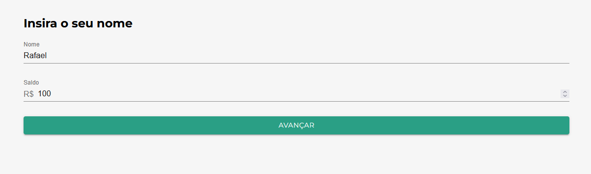
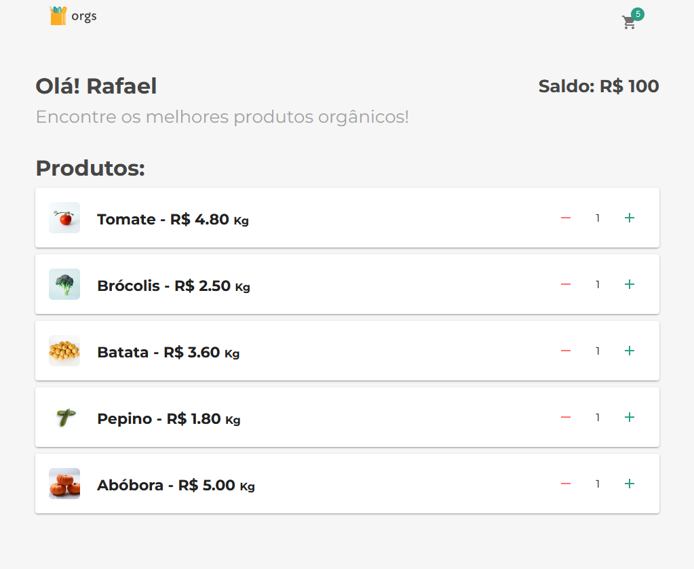
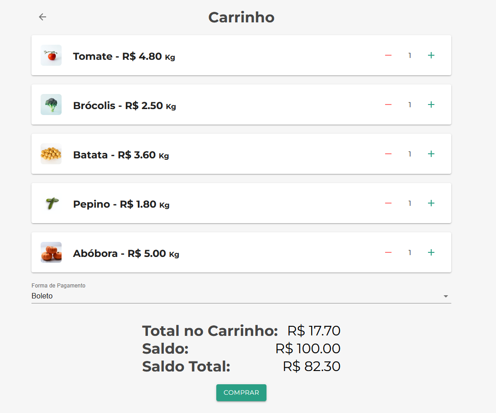

<h4 align="center"> 
	
</h4>
<p align="center">
 <a href="#-sobre-o-projeto">Sobre</a> •
 <a href="#-funcionalidades">Funcionalidades</a> •
 <a href="#-layout">Layout</a> •
 <a href="#-tecnologias">Tecnologias</a> •
 <a href="#-autor">Autor</a> • 
 <a href="#user-content--licença">Licença</a>
</p>

# ALURA FEIRA

<h1 align="center">
    
    
    
</h1>
    

## 💻 Sobre o projeto

🚀 Alura Feira é uma página de um e-commerce, site feito para se utilizar e gerenciar estados globais com Gontext API.

---

## ⚙️ Funcionalidades

- [x] Permite colocar seu nome e saldo;
- [x] Dispõe uma pequena lista de protudos para a pessoa escolher o que deseja comprar;
- [x] Faz o calculo do saldo, define forma de pagamento com ou sem juros e realiza a compra de forma automatizada;


## 🎨 Layout

O layout da aplicação não está disponível em nenhum local, foi criado de forma simples apenas para colocar em prática o ContextAPI e aprender um pouco mais sobre o react. O projeto clone está no github indicado mais abaixo.


## 📝 Aprendizados

Neste projeto fiz um e-commerce, que tem três telas, e três contextos para se comunicar entre essas telas. A primeira tela foi a tela de login, onde teríamos o nosso primeiro contexto, que é o contexto de usuário. Nesse contexto existe o nome e o saldo.

A próxima tela é a tela de feira, nessa tela utilizei o contexto de carrinho, que foi o contexto mais complexo da aplicação. Nesse contexto tem os produtos, então o "cliente" consegue adicionar ou remover produtos. Nesse contexto utilizamos o provider para os componentes. Também coloquei esse provider de forma dinâmica, para não colocar tudo no root da aplicação e ficar pesada a aplicação, com isso melhorando a performance.

Também foi utilizado hooks customizados para centralizar a responsabilidade de manutenção do contexto fora dos componentes, isso deixa o componente mais desacoplado, assim é possivel reaproveitar, como, por exemplo, reaproveitei o componente produto na tela de carrinho.

Também foi resolvido problemas como o prop drilling, que é um problema de ficarmos passando props de componente para componente, porque com o Context API não é preciso fazer isso, só o provemos lá em cima e podemos usar o último componente lá de baixo, desse estado. Isso melhora a performance, porque não é preciso ficar colocando o provider em vários lugares, apenas onde realmente é necessário utilizar. Também melhora a questão do bundle, isso deixa um bundle menor, porque não é preciso ficar usando o props, que é uma coisa relativamente pesada. 

E temos a terceira tela, que é a tela de carrinho. Que foi utilizado o terceiro contexto, de pagamento. Nesse contexto foi definido que, por exemplo, se o "cliente" selecionásse a forma de pagamento para cartão de crédito, ia ter juros, e esses juros serão aplicados no total do carrinho. Isso está sendo calculado de forma automática, de forma dinâmica quando o contexto de pagamento muda. O cálculo desse valor total é no contexto de carrinho e quando o contexto de pagamento muda, o contexto de carrinho sabe que ele mudou e ele faz esse cálculo de novo.

#### 🧭 Rodando a aplicação web (Modo desenvolvimento)

```bash
# Clone este repositório
$ git clone https://github.com/alura-cursos/react-context/tree/main
# Acesse a pasta do projeto no seu terminal/cmd
$ cd  feira
# Instale as dependências
$ npm install
# Execute a aplicação em modo de desenvolvimento
$ npm run start
# A aplicação será aberta na porta:3000 - acesse http://localhost:3000
```
---

## 🛠 Tecnologias

As seguintes ferramentas foram usadas na construção do projeto:

#### **Website**

- **[React](https://reactjs.org/)**
- **[React Router Dom](https://reactrouter.com/en/main)**
- **[Sass](https://sass-lang.com/)**
- **[React Context DevTool](https://chrome.google.com/webstore/detail/react-context-devtool/oddhnidmicpefilikhgeagedibnefkcf)**

#### **Utilitários**

- Protótipo: **[Github](https://github.com/alura-cursos/react-context/tree/main)** → **[Protótipo (Alura Feira)](https://github.com/alura-cursos/react-context/tree/main)**
- Editor: **[Visual Studio Code](https://code.visualstudio.com/)**
  - Extensão: **[S7 React/Redux/React-Native/JS snippets](https://marketplace.visualstudio.com/items?itemName=dsznajder.es7-react-js-snippets)**
- CSS Modules: **[CSS Modules](https://github.com/css-modules/css-modules)**
- Documentação do React: **[React Documentation](https://create-react-app.dev/docs/adding-a-stylesheet/)**

---

## 🦸 Autor

 <sub><b>Rafael Corrêa</b></sub></a> <a href="https://www.linkedin.com/in/correarafaelsantos/" title="Alura Space">🚀</a>
 <br />
👋🏽 [Entre em contato pelo Linkedin!](https://www.linkedin.com/in/correarafaelsantos/)

---